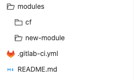
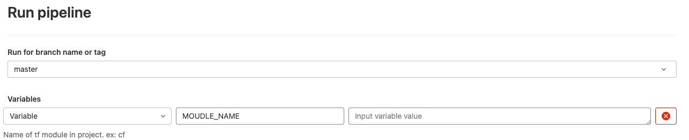
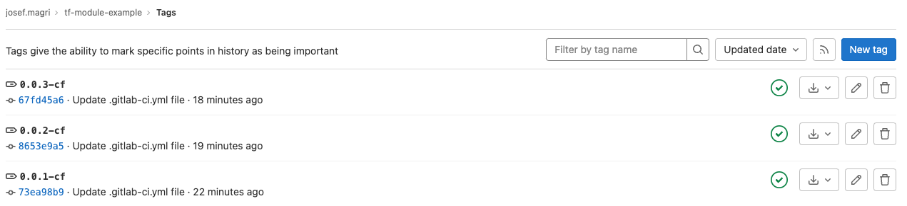
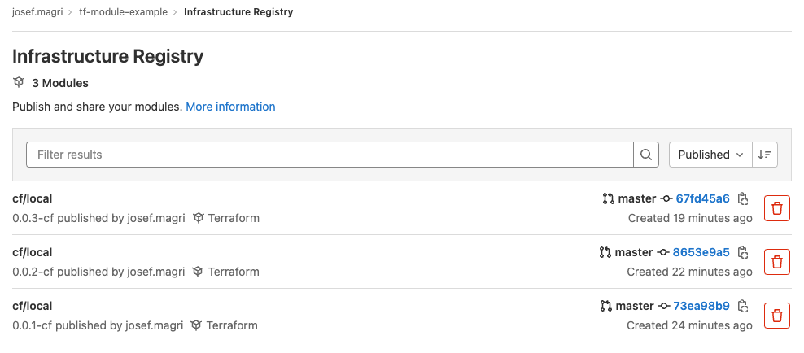

# Using Gitlab Terraform modules

This Repo shows an example how to automate the process of managing terraform modules automatically with Gitlab Infrastructure Registry and tags.

## How to use

1. Create CICD Variable called 'ACCESS_TOKEN' and set access token to project in it.
2. Create new module under 'modules' directory



3. Run pipeline by defining the name of the moudle matching it's directory



## What will the result be

1. If the pipeline is being run for the first time on a module, the pipeline will generate a new tag in the following format 0.0.1-<MODULE_NAME>
2. If a tag is already present, the pipeline will generate a new tag, incrementing the last of generated for the module.



3. After this is done, the last step is for the pipeline to package the module and store it in the current gitlab project 'Infrastructure Registry'



4. To use the module in a terraform script, the following format has to be used, including the version of the module needed.

Copy and paste into your Terraform configuration, insert the variables, and run Terraform init:
```
module "my_module_name" {
  source = "gitlab.qredo.com/josef.magri/cf/local"
  version = "0.0.3-cf"
}
```

To authorize access to the Terraform registry create a new file in your home directory outside terraform *.terraformrc* with the following block:
```
credentials "gitlab.qredo.com" {
  token = "<TOKEN>"
}
```
